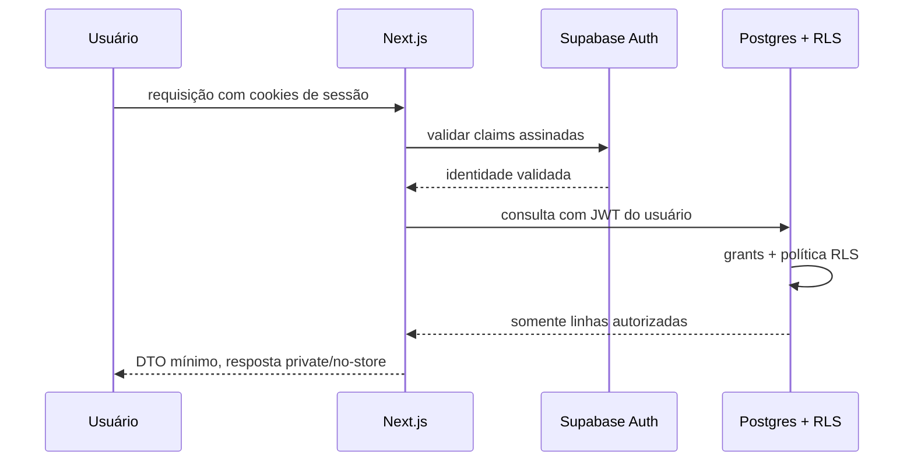

# Arquitetura e modelo de dados

## Decisões iniciais

| Tema | Decisão |
|---|---|
| Aplicação | Next.js App Router com TypeScript, uma aplicação na raiz |
| Renderização | Server Components por padrão; cliente apenas quando necessário |
| Backend | Route Handlers na Vercel; evitar um segundo backend no MVP |
| Identidade | Supabase Auth com sessão SSR e claims validadas |
| Dados | Supabase Postgres, migrations locais e RLS deny-by-default |
| IA | Gateway server-only; regras e cálculos fora do modelo |
| Mercado | Ingestão server-only, diária, idempotente e com proveniência |
| UI | CSS custom properties do handoff; sem framework visual obrigatório |
| Deploy | Vercel; ambientes e projetos Supabase completamente isolados |

As chaves legadas `anon`/`service_role` não devem ser adotadas em um projeto
novo. Usar as chaves publicável e secreta atuais do Supabase. A publicável
identifica o projeto, mas não é um segredo; grants e RLS são o controle de
acesso. A secreta ignora RLS e nunca entra em caminho executável pelo cliente.

## Ambientes

| Ambiente | Vercel | Supabase | Dados | Segredos |
|---|---|---|---|---|
| Local | servidor local | stack local | seed sintético | `.env.local`, fora do Git |
| Preview | deployment de PR | projeto/branch não produtivo | sintéticos | cofre Preview |
| Staging | domínio restrito | projeto dedicado | sintéticos representativos | cofre Staging |
| Produção | domínio oficial | projeto dedicado | reais | cofre Production |

Preview nunca herda a chave secreta, banco ou provedor com limite de produção.
Promoções executam a mesma migration revisada; não se altera schema pelo
Dashboard sem uma migration equivalente.

## Acesso a dados

Regras:

- toda leitura e mutação passa por uma DAL marcada com `server-only`;
- identidade é validada, mas cada caso de uso também verifica autorização;
- o cliente do usuário é diferente do cliente administrativo;
- o cliente administrativo existe somente em adapters de cron/worker, não é
  exportado por módulo genérico;
- componentes recebem DTOs mínimos, não linhas integrais do banco;
- nenhuma função aceita `user_id` do navegador como fonte de identidade.

## Modelo conceitual recomendado

O esboço do handoff deve ser refinado antes da primeira migration.

### Identidade, consentimento e suitability

`profiles`

- `id uuid` igual a `auth.users.id`;
- nome de exibição, tema, locale e estado do onboarding;
- não duplicar e-mail salvo pelo Auth sem uma necessidade comprovada;
- `created_at`, `updated_at` e `deleted_at`.

`consent_records`

- usuário, tipo e versão do documento;
- instante, origem e evidência mínima do aceite;
- append-only para preservar histórico.

`suitability_assessments`

- usuário, versão do questionário e respostas validadas;
- pontuação calculada, perfil resultante e alocação-alvo;
- `completed_at` e motivo (`onboarding` ou `reassessment`);
- append-only; `profiles` pode apontar para a avaliação vigente.

Não sobrescrever avaliações anteriores: isso impede explicar por que uma
sugestão passada foi gerada para determinado perfil.

### Instituições e produtos

`institutions`

- catálogo global curado;
- nome oficial, país, tipo e estado de publicação.

`user_institutions`

- vínculo privado do usuário com uma instituição;
- apelido opcional e origem manual;
- uma instituição digitada pelo usuário não vira catálogo global.

`product_offers`

- instituição, classe, nome, taxas, liquidez, vencimento e proteção;
- campos estruturados e moeda;
- estado `draft|reviewed|published|expired`.

`product_sources`

- oferta, URL canônica, publicador, data de coleta e validade;
- hash/evidência do conteúdo permitido pela licença.

`product_research_runs`

- solicitação privada, status, fontes e erros redigidos;
- resultado permanece draft até revisão.

### Carteira

`instruments`

- identificador canônico, ticker, nome, classe, moeda e mercado;
- ativo customizado é privado até ser mapeado/curado.

`portfolio_transactions`

- usuário, instrumento, instituição e tipo;
- data de negócio, quantidade, preço unitário, taxas e moeda;
- tipos incluem compra, venda, aporte, resgate, rendimento e ajuste;
- registro imutável: correção cria reversão + nova movimentação.

`position_snapshots`

- posição derivada por usuário/instrumento/data;
- usada para leitura rápida, nunca como única fonte da verdade.

`portfolio_valuations`

- valor diário da carteira e benchmark usado;
- permite rentabilidade consistente e explicável.

Quantidades e dinheiro usam `numeric` com escala definida. JavaScript não
calcula valores monetários com `number`; usar decimal explícito e formatar
apenas na borda da UI.

### Mercado e conteúdo

`market_instruments`

- mapeia instrumentos do domínio para IDs do provedor.

`market_prices`

- instrumento, instante, abertura, máxima, mínima, fechamento, volume e moeda;
- unique por instrumento/provedor/instante.

`market_indicators`

- indicador, data, valor, unidade e fonte;
- Selic, CDI e câmbio não viram colunas fixas de uma tabela larga.

`news_articles`

- URL canônica, título, publicador, data, categoria e direitos de uso;
- resumo gerado separado do texto original;
- nunca copiar artigo integral sem licença.

`watchlist_items`

- usuário e instrumento;
- unique por usuário/instrumento.

Todo valor exibido leva fonte e `observed_at`. O app diferencia “último
fechamento” de cotação em tempo real.

### Metas e simulações

`goals`

- usuário, tipo, nome, valor-alvo, prazo e premissas;
- valor atual é derivado, não digitado como fato sem trilha.

`goal_allocations`

- liga movimentações/posições a uma meta sem duplicar patrimônio.

`contribution_plans`

- aporte planejado, frequência e estado;
- não representa débito automático nem ordem executada.

`investment_simulations`

- usuário, parâmetros, alocação proposta, premissas e resultado;
- versão do motor de cálculo para reproduzir a simulação.

### Assistente e auditoria

`assistant_threads` e `assistant_messages`

- privados por usuário;
- retenção curta e configurável;
- conteúdo pode ser excluído sem quebrar auditoria técnica.

`ai_generations`

- tipo, versão de prompt/modelo, IDs das fontes e status;
- armazenar hashes, métricas e razão da geração;
- não armazenar token, prompt bruto com PII ou resposta indefinidamente.

`audit_events`

- ator, ação, recurso, resultado e metadados redigidos;
- append-only e sem valores de carteira no payload;
- acesso apenas operacional e com retenção definida.

## Matriz de acesso

| Categoria | `anon` | `authenticated` | servidor privilegiado |
|---|---:|---:|---:|
| Perfil, carteira, metas, watchlist | nenhum | somente o próprio usuário | jobs explicitamente autorizados |
| Consentimento e suitability | nenhum | leitura própria; escrita por casos de uso | auditoria autorizada |
| Catálogo publicado | nenhum no MVP | leitura de itens publicados | curadoria |
| Rascunhos de pesquisa | nenhum | somente solicitação própria | worker/revisor |
| Mercado e notícias publicados | nenhum no MVP | leitura | ingestão/curadoria |
| Auditoria operacional | nenhum | nenhum | função operacional dedicada |

Mesmo tabelas de catálogo não recebem grants de escrita para
`authenticated`. Dados “públicos” no sentido de domínio continuam disponíveis
somente após login, salvo decisão explícita em contrário.

## Padrão obrigatório de RLS

Para cada tabela privada:

1. habilitar RLS na mesma migration que cria a tabela;
2. revogar privilégios amplos e conceder somente operações necessárias;
3. política `USING` limita linhas existentes a `auth.uid()`;
4. política `WITH CHECK` impede inserir ou mover linha para outro usuário;
5. `user_id` é `not null` e não é confiado a payload externo;
6. testar usuário dono, segundo usuário, anônimo e ausência de JWT;
7. testar todas as operações, inclusive `upsert`, RPC e views.

Views devem usar `security_invoker`. Funções `security definer` são exceção,
com `search_path` fixo, grants explícitos e teste específico. A chave secreta
não é usada para “resolver” política RLS.

## Constraints e índices

- foreign keys sempre definidas; deleção em cascata somente quando a política
  de retenção permitir;
- `created_at` e `updated_at` em UTC (`timestamptz`);
- `check` para valores positivos, moedas, estados e intervalos;
- unicidade composta por tenant onde necessário;
- índice começa por `user_id` nas consultas privadas frequentes;
- índices de preço por `(instrument_id, observed_at desc)`;
- idempotency key única em webhooks, jobs e pesquisas;
- paginação por cursor, nunca leitura sem limite de histórico.

## Jobs e integrações

O endpoint de cron valida exatamente
`Authorization: Bearer ${CRON_SECRET}` antes de executar. O job:

1. adquire lock para evitar concorrência;
2. cria um `ingestion_run`;
3. busca somente hosts permitidos, com timeout e limite de bytes;
4. valida schema, moeda, timestamp e faixas plausíveis;
5. faz upsert com chave idempotente;
6. registra contagens e erros redigidos;
7. alerta sobre atraso, anomalia ou falha total.

O job da Vercel roda apenas em produção. Staging precisa de acionamento
autenticado separado e dados do provedor de sandbox.

## Referências oficiais

- [Chaves de API do Supabase](https://supabase.com/docs/guides/getting-started/api-keys)
- [Proteção de dados e RLS](https://supabase.com/docs/guides/database/secure-data)
- [Cliente Supabase SSR para Next.js](https://supabase.com/docs/guides/auth/server-side/creating-a-client)
- [Testes de banco com pgTAP](https://supabase.com/docs/guides/database/testing)
- [Segurança de dados no Next.js](https://nextjs.org/docs/app/guides/data-security)
- [Cron seguro na Vercel](https://vercel.com/docs/cron-jobs/manage-cron-jobs)
