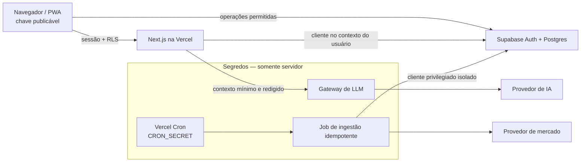

# Plano de implementação do North

## Objetivo do MVP

Entregar uma PWA mobile-first em PT-BR que permita:

- autenticação e classificação de suitability;
- cadastro manual de patrimônio e movimentações;
- acompanhamento de carteira, metas e dados de mercado;
- simulações educacionais de alocação;
- explicações do North baseadas somente em perfil, carteira cadastrada, metas
  e dados de mercado conhecidos pelo sistema.

Não fazem parte do MVP: Open Finance, leitura de saldo bancário, custódia,
execução de ordens ou recomendação autônoma de ativos.

## Ajustes necessários antes de construir

O handoff é uma boa referência visual, mas quatro pontos não podem ser
implementados literalmente:

1. **“Aplicar distribuição” conflita com a não execução de ordens.** No MVP, a
   ação deve salvar ou exportar uma simulação, com texto que não sugira que o
   North movimentou dinheiro.
2. **Um disclaimer não garante conformidade regulatória.** O uso de
   “assessor”, a classificação de suitability, as sugestões e todo o fluxo
   precisam de revisão jurídica/compliance antes do beta.
3. **`holdings` sozinho não calcula rentabilidade corretamente.** A fonte da
   verdade deve ser um livro de movimentações; posições são derivadas.
4. **Pesquisa automática de produtos não pode publicar conteúdo não
   verificado.** Fontes, licença de uso, data de coleta e revisão devem ser
   rastreáveis. Conteúdo externo é entrada não confiável para o LLM.

## Arquitetura proposta

Uma única aplicação Next.js App Router, hospedada na Vercel, com Postgres,
Auth e RLS no Supabase. Route Handlers concentram integrações privilegiadas.
Server Components são o padrão; Client Components ficam restritos à
interação que realmente precisa do navegador.



Regras de fronteira:

- o navegador pode conhecer apenas URL e chave **publicável** do Supabase;
- a chave secreta do Supabase fica em módulos `server-only`, usados somente
  por jobs administrativos bem delimitados;
- requisições normais do app usam o JWT do usuário e continuam sujeitas a
  RLS, inclusive quando passam pelo servidor Next.js;
- o provedor de IA nunca recebe e-mail, nome, identificadores, tokens ou o
  histórico integral da conta;
- o protótipo `.dc.html` é documentação executável e não entra no deploy.

## Organização do código

```text
src/
  app/
    (public)/           # splash, entrar, criar conta e páginas legais
    onboarding/         # bancos, suitability e resultado
    (app)/              # início, investir, carteira e mercado
    assessor/           # chat educacional
    metas/
    produtos/
    perfil/
    api/
      ai/               # gateway autenticado e com rate limit
      cron/             # ingestão autenticada por CRON_SECRET
      webhooks/         # assinatura verificada antes do parsing
  components/
    ui/                 # primitivas acessíveis e sem regra de negócio
    navigation/
  features/
    auth/
    suitability/
    portfolio/
    goals/
    market/
    products/
    assistant/
  server/
    auth/               # validação de identidade e autorização
    dal/                # única camada que consulta dados
    ai/                 # prompts, schemas, redaction e políticas
    market/             # adapters, normalização e proveniência
    env/                # validação fail-fast das variáveis
  styles/
    tokens.css
supabase/
  migrations/
  seed.sql              # somente dados sintéticos
  tests/
tests/
  e2e/
```

As rotas compõem casos de uso, mas não acessam tabelas ou `process.env`
diretamente. A camada de dados e integrações deve importar `server-only`.

## Sequência de construção

### Marco 0 — fundação segura

Entregas:

- iniciar Next.js com TypeScript estrito, runtime e gerenciador de pacotes
  fixados e lockfile versionado;
- configurar lint, formatação, testes, build e verificação de tipos no CI;
- criar três ambientes isolados: local, preview/staging e produção;
- iniciar Supabase local, migrations e testes pgTAP;
- validar variáveis de ambiente no boot, separando schema público e privado;
- aplicar headers de segurança e CSP primeiro em modo report-only;
- configurar proteção de branch, revisão obrigatória, secret scanning, push
  protection, Dependabot e CodeQL no GitHub;
- registrar modelo de ameaças e classificação dos dados.

Gate de saída:

- nenhum segredo no histórico;
- build reproduzível;
- teste automatizado prova que usuário A não lê nem altera dados do usuário B;
- preview não se conecta ao Supabase de produção;
- protótipo e documentação não fazem parte do artefato Vercel.

### Marco 1 — Auth, onboarding e suitability

Entregas:

- cadastro, confirmação de e-mail, login, logout e recuperação;
- renovação de sessão SSR com validação criptográfica das claims;
- aceite versionado de Termos e Política de Privacidade;
- questionário completo, versionado e calculado por regra determinística;
- resultado e alocação-alvo persistidos de forma auditável;
- fluxo para refazer o questionário sem reentrar no onboarding.

Gate de saída:

- rate limit nos endpoints de autenticação;
- proteção contra enumeração de e-mail;
- políticas RLS e grants cobertos por testes de SELECT/INSERT/UPDATE/DELETE;
- sessão e respostas autenticadas marcadas como `private, no-store`;
- revisão jurídica do questionário, textos e uso do termo “assessor”.

### Marco 2 — carteira manual

Entregas:

- cadastro de instituição, ativo e movimentação;
- livro de compras, vendas, aportes, resgates, rendimentos e taxas;
- posições, custo médio, patrimônio e distribuição derivados;
- edição e exclusão com histórico de auditoria;
- importação fica fora do MVP até existir parsing seguro e consentimento.

Gate de saída:

- dinheiro em `numeric`, nunca `float`;
- regras financeiras testadas com casos de arredondamento, venda parcial,
  ativo sem preço e cotação desatualizada;
- acesso cruzado entre contas bloqueado no banco, não apenas na UI.

### Marco 3 — dados de mercado e Início

Entregas:

- escolher provedor com licença compatível, SLA e cobertura documentados;
- catálogo normalizado de instrumentos, preços e indicadores;
- job diário pós-fechamento idempotente, autenticado e observável;
- indicação visual de fonte, moeda, horário e defasagem de cada dado;
- tela Início e tela Mercado com estado vazio e estado desatualizado.

Gate de saída:

- assinatura ou segredo do cron verificado com comparação segura;
- timeout, retry com backoff, circuit breaker e limite de custo;
- payload externo validado antes de persistir;
- alerta quando o snapshot esperado não chega ou contém anomalia.

### Marco 4 — metas e simulação de investimento

Entregas:

- metas predefinidas e personalizadas;
- aportes planejados e progresso derivado;
- simulador livre ou associado a uma meta;
- distribuição editável, comparação com alvo e premissas explícitas;
- salvar plano/simulação sem sugerir execução de ordem.

Gate de saída:

- cálculo reproduzível no servidor e no teste, sem depender do LLM;
- premissas, inflação, taxas e limitações exibidas;
- cenários inválidos e extremos tratados sem `NaN`, overflow ou divisão por
  zero.

### Marco 5 — North e sugestões educacionais

Entregas:

- motor determinístico produz fatos e sinais, como desvio da alocação-alvo;
- gateway do LLM transforma sinais em explicações didáticas;
- saída estruturada, validada e com disclaimer inserido pelo servidor;
- chat com limites de uso, moderação, retenção definida e opção de exclusão;
- trilha de auditoria redigida com versão do prompt, modelo e fontes.

Gate de saída:

- nenhuma chave ou chamada ao provedor no navegador;
- prompt injection, payload grande, abuso de custo e resposta inválida
  cobertos por testes;
- o disclaimer é aplicado pela aplicação, não confiado ao modelo;
- resposta não inventa saldo, posição, preço ou fonte;
- fallback seguro quando a IA está indisponível.

Escopo posterior ao uso doméstico:

- oferecer mais interações de IA apenas por entitlement de plano pago;
- integrar cobrança somente na preparação de produção, com webhooks
  idempotentes e limite server-side independente da interface;
- manter uma cota gratuita controlada e fallback determinístico mesmo após a
  monetização.

### Marco 6 — bancos e produtos

Entregas:

- catálogo curado de instituições e vínculo manual do usuário;
- produtos com fonte, data de verificação, jurisdição e condições;
- pesquisa de instituição customizada em fila, sem publicar automaticamente;
- “Vale a pena?” apresentado como comparação educacional de critérios.

Gate de saída:

- URLs de coleta limitadas por allowlist, sem fetch de endereço arbitrário;
- proteção contra SSRF e conteúdo malicioso;
- informação vencida é ocultada ou marcada claramente;
- revisão humana antes de promover pesquisa para o catálogo global.

### Marco 7 — PWA e lançamento

Entregas:

- manifest, ícones, instalação e estratégia de atualização;
- cache apenas de shell e assets estáticos com hash;
- acessibilidade, responsividade e temas claro/escuro;
- exportação e exclusão de conta/dados;
- runbooks de incidente, restauração, rotação de chaves e indisponibilidade.

Gate de saída:

- logout remove caches e estado local;
- páginas e APIs autenticadas não funcionam offline com dados antigos;
- teste de restauração do banco e rotação de todos os segredos;
- pentest independente e correção dos achados críticos/altos;
- aceite de segurança, privacidade e compliance.

## Estratégia de testes

- **Domínio:** testes unitários para suitability, carteira, metas e simulações.
- **Banco:** pgTAP para schema, constraints, grants e RLS; sempre incluir
  cenários anônimos, usuário dono e usuário adversário.
- **Integração:** Route Handlers contra Supabase local e provedores simulados.
- **Interface:** componentes, acessibilidade e estados de erro/vazio/loading.
- **E2E:** cadastro, onboarding, movimentação, meta, simulação e exclusão.
- **Segurança:** secret scan, SAST, dependency review, análise do bundle,
  headers/CSP, rate limit e testes de autorização em toda mutação.

Dados de teste são sintéticos. Testes e previews nunca recebem dump de
produção.

## Definição de pronto para qualquer funcionalidade

- ameaça e abuso previsíveis considerados;
- autenticação e autorização verificadas no servidor e no banco;
- entrada validada e saída codificada;
- logs sem PII, tokens, prompts completos ou valores financeiros detalhados;
- estados de erro não revelam existência de conta ou detalhes internos;
- testes positivos e negativos adicionados;
- métricas e alertas úteis sem conteúdo sensível;
- documentação, migration e decisão arquitetural atualizadas;
- acessibilidade por teclado, leitor de tela e alvo mínimo de toque;
- revisão de produto/compliance quando houver texto financeiro.

## Decisões bloqueantes

1. Provedor de mercado, licença de redistribuição e limites de uso.
2. Provedor de IA, retenção, uso para treinamento, região e contrato de dados.
3. Parecer jurídico sobre posicionamento, suitability e textos de interface.
4. MFA obrigatório ou adaptativo e fatores aceitos.
5. Região do Supabase/Vercel, política LGPD e prazo de retenção por categoria.
6. Modelo exato de rentabilidade e tratamento tributário no MVP.
7. Processo de curadoria dos produtos e responsáveis pela aprovação.
8. RPO/RTO, plano do Supabase e necessidade de PITR.

Essas escolhas devem ser registradas como ADRs antes do marco que depende
delas.
